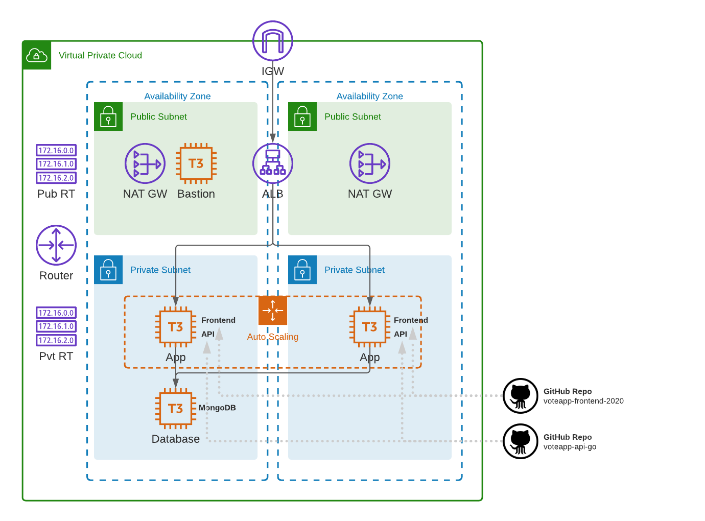
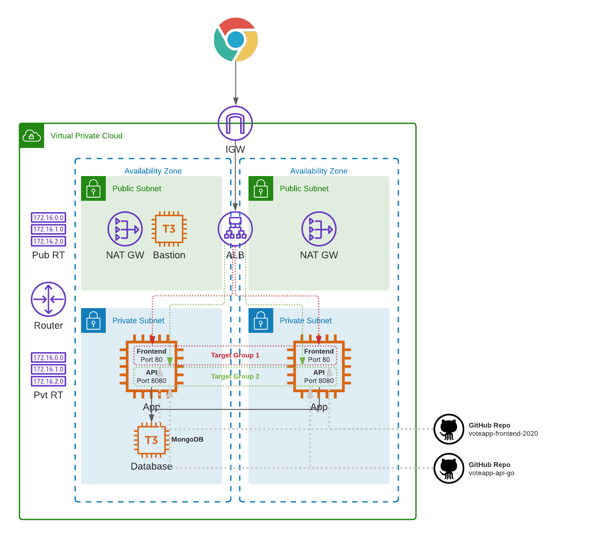

Triển khai 1 ứng dụng voteapp lên AWS sử dụng IAC (Terraform)


VPC sẽ bao gồm 2 khu vực phát triển (AZs) và có cả các mạng con công cộng và riêng tư. Một cổng Internet (internet gateway) và cổng NAT (NAT gateway) sẽ được triển khai vào đó. Bảng định tuyến công cộng và riêng tư sẽ được thiết lập. Một trình cân bằng tải ứng dụng (ALB) sẽ được cài đặt để phân phối tải lưu lượng qua một nhóm tự mở rộng (ASG) của các máy chủ web Nginx được cài đặt với giao diện người dùng và API của ứng dụng cloud native. Một phiên bản cơ sở dữ liệu chạy MongoDB sẽ được cài đặt trong khu vực riêng tư. Các nhóm bảo mật sẽ được tạo và triển khai để bảo vệ tất cả lưu lượng mạng giữa các thành phần khác nhau.

Cả giao diện người dùng và API sẽ được triển khai trên cùng một EC2.



* Frontend: https://github.com/cloudacademy/voteapp-frontend-react-2020/releases/latest

* API: https://github.com/cloudacademy/voteapp-api-go/releases/latest

#### ALB Target Group Configuration

ALB sẽ được cấu hình với một listener duy nhất (port 80). Hai nhóm mục tiêu sẽ được thiết lập. Nhóm mục tiêu cho phần giao diện người dùng trỏ đến máy chủ web Nginx (port 80). Nhóm mục tiêu cho phần API trỏ đến dịch vụ API tùy chỉnh (port 8080).



#### Project Structure

```
├── main.tf
├── modules
│   ├── application
│   │   ├── main.tf
│   │   ├── outputs.tf
│   │   └── vars.tf
│   ├── bastion
│   │   ├── main.tf
│   │   ├── outputs.tf
│   │   └── vars.tf
│   ├── network
│   │   ├── main.tf
│   │   ├── outputs.tf
│   │   └── vars.tf
│   ├── security
│   │   ├── main.tf
│   │   ├── outputs.tf
│   │   └── vars.tf
│   └── storage
│       ├── install.sh
│       ├── main.tf
│       ├── outputs.tf
│       └── vars.tf
├── outputs.tf
├── terraform.tfvars
└── variables.tf
```